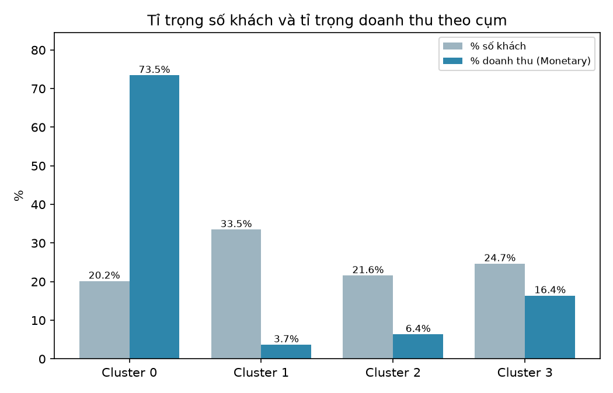
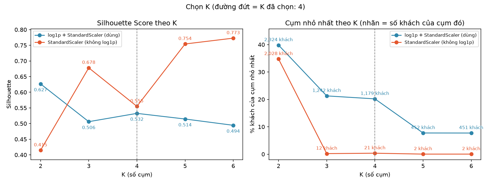
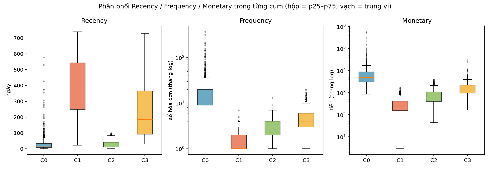

# Customer Segmentation on Big Transaction Data

**Phân khúc khách hàng từ dữ liệu giao dịch lớn** — pipeline Big Data chạy thật trên **Hadoop HDFS + Apache Spark** (Docker),
từ 1.07 triệu dòng giao dịch bán lẻ tới các nhóm khách hàng có thể dùng cho marketing.

```text
Online Retail II ─► HDFS ─► Spark (PySpark) ─► Làm sạch ─► RFM ─► log1p + StandardScaler ─► K-Means ─► Silhouette ─► Phân tích cụm ─► Biểu đồ
```

> Đồ án môn Big Data, thực hiện một mình. Mọi con số trong README và `docs/` lấy từ lần chạy thật (2026-10-01),
> pipeline đã chạy lại end-to-end và cho **cùng kết quả**.

---

## 1. Bài toán

Một cửa hàng bán lẻ trực tuyến có hàng nghìn khách nhưng đối xử với mọi khách như nhau. Câu hỏi:
**làm sao chia khách thành các nhóm có hành vi mua giống nhau, chỉ từ lịch sử giao dịch?**

Cách làm: mô tả mỗi khách bằng 3 con số **RFM** rồi phân cụm bằng **K-Means**:

| | Câu hỏi | Cách tính |
|---|---|---|
| **R**ecency | Lần cuối mua cách đây bao lâu? | Số ngày từ lần mua gần nhất tới AnalysisDate (2011-12-10) |
| **F**requency | Mua bao nhiêu lần? | Số hóa đơn khác nhau |
| **M**onetary | Đã chi bao nhiêu? | Tổng `Quantity × UnitPrice` |

## 2. Kết quả chính

| Bước | Kết quả |
|---|---|
| Dữ liệu gốc | **1,067,371** dòng × 8 cột, 94.3 MB, 12/2009 – 12/2011 (UCI Online Retail II) |
| Làm sạch (9 rule, PySpark) | → **770,563** dòng (72.19%): bỏ 34,335 dòng trùng, 25,250 dòng hủy + dòng mua bị hủy, 228,487 dòng thiếu CustomerID, … |
| RFM | **5,839** khách hàng |
| Chọn K (K = 2..6) | **K = 4**, Silhouette **0.5325**, cụm nhỏ nhất 20.2% số khách |

4 nhóm khách (tên do người phân tích đề xuất **sau khi** xem số liệu):

| Nhóm | Khách | Median Recency / Frequency / Monetary | % doanh thu | Hướng hành động (đề xuất) |
|---|---:|---|---:|---|
| Giá trị cao, trung thành | 1,179 (20.2%) | 17 ngày / 13 lần / 4,877 | **73.5%** | Giữ chân, chăm sóc riêng |
| Có nguy cơ rời bỏ | 1,442 (24.7%) | 185 / 4 / 1,445 | 16.4% | Win-back cá nhân hóa |
| Khách mới / tiềm năng | 1,261 (21.6%) | 24 / 3 / 715 (gắn bó ~220 ngày) | 6.4% | Nuôi dưỡng mua lặp lại |
| Đã rời bỏ / mua 1 lần | 1,957 (33.5%) | 402 / 1 / 269 | 3.7% | Kích hoạt chi phí thấp |

**Phát hiện nổi bật:** 20% khách tạo ra 73.5% doanh thu. Các đề xuất hành động **chưa được kiểm chứng** bằng thực nghiệm (A/B test).

| Tỉ trọng khách vs doanh thu | Chọn K: Silhouette và cụm nhỏ nhất |
|---|---|
|  |  |



> Ảnh trong `docs/images/` là bản sao của `output/reports/charts/` (thư mục `output/` không commit). Đủ 7 biểu đồ: chạy bước 13 ở mục 6.

## 3. Kiến trúc

```text
 Windows host (.venv Python 3.12)                    Docker Compose (project "customer-segmentation")
 ┌──────────────────────────────┐        ┌────────────────────── HDFS ──────────────────────┐
 │ download_dataset.py          │        │ namenode :8020  metadata (file → block → node)   │
 │ upload_to_hdfs.py ───────────┼──────► │ datanode :9866  lưu block                        │
 │ init_hdfs.py                 │        └───────────────▲──────────────────────────────────┘
 │ charts.py (Matplotlib)  ◄────┼─ bảng nhỏ            │ đọc/ghi Parquet
 └──────────────────────────────┘  output/ (bind mount)  │
                                         ┌───────────────┴────────── Spark 4.0.4 ───────────┐
                                         │ spark-master :7077 + driver (spark-submit)       │
                                         │ spark-worker → executor 4 core (MLlib K-Means)   │
                                         └──────────────────────────────────────────────────┘
```

- **HDFS** lưu toàn bộ dữ liệu của pipeline: `raw/` (CSV gốc) → `processed/` → `rfm/` → `output/clustering`, `output/analysis` (Parquet).
- **Spark** đọc/ghi trực tiếp từ HDFS; driver chạy **trong container** vì host Windows không kết nối được DataNode trong Docker network.
- Biểu đồ vẽ trên host từ các **bảng nhỏ đã tổng hợp** do Spark export ra `output/` (pandas chỉ dùng cho các bảng này).

Chi tiết: [`docs/04_architecture.md`](docs/04_architecture.md).

## 4. Công nghệ

| Thành phần | Công nghệ | Dùng để |
|---|---|---|
| Lưu trữ phân tán | Hadoop HDFS 3.4.1 (`apache/hadoop`) | Lưu raw + processed + kết quả |
| Xử lý phân tán | Apache Spark 4.0.4 / PySpark (Standalone) | Làm sạch, RFM, phân tích cụm |
| Machine Learning | Spark MLlib | VectorAssembler, StandardScaler, KMeans, ClusteringEvaluator |
| Hạ tầng | Docker Desktop + Docker Compose | 4 container: namenode, datanode, spark-master, spark-worker |
| Định dạng | CSV (raw), Parquet (processed/kết quả) | Raw giữ nguyên định dạng nguồn; Parquet dạng cột, có schema, nén tốt |
| Biểu đồ | Matplotlib | 7 biểu đồ PNG cho báo cáo |
| Web Demo | HTML + CSS + Vanilla JS, server tĩnh `http.server` | Trình bày kết quả (chỉ đọc output), không phải một phần của pipeline |
| Ngôn ngữ | Python 3.12 (host), 3.10 (container Spark) | |

## 5. Cài đặt

**Yêu cầu:** Windows/Linux/macOS · Python 3.12 · Java 17 hoặc 21 (cho PySpark trên host) · Docker Desktop.
Project đã chạy với Docker Desktop 16 CPU / 7.6 GB RAM; cluster dùng 1 worker 4 core, 2 GB.

```bash
py -3.12 -m venv .venv
.venv\Scripts\activate                      # Linux/macOS: source .venv/bin/activate
pip install -r requirements.txt
copy .env.example .env                      # tùy chọn

python scripts\download_dataset.py          # tải Online Retail II từ UCI -> data/raw/online_retail_II.csv (mạng UCI chậm, cần kiên nhẫn)
docker compose up -d                        # lần đầu: build image Spark (thêm pyyaml, python-dotenv, numpy)
docker compose ps                           # namenode, datanode (healthy), spark-master, spark-worker (Up)
```

Web UI: HDFS http://localhost:9870 · Spark Master http://localhost:8080 · Spark Worker http://localhost:8081 · Job đang chạy http://localhost:4040

## 6. Chạy pipeline

Đặt `SUBMIT = docker compose exec spark-master /opt/spark/bin/spark-submit --master spark://spark-master:7077`.
Thứ tự dưới đây là lần chạy end-to-end đã kiểm tra (13 bước, ≈ 5 phút, mọi check in `RESULT: PASS`):

| # | Lệnh | Làm gì | Output |
|---|---|---|---|
| 1 | `python scripts\init_hdfs.py` | Tạo thư mục HDFS (chạy lại an toàn) | `/data/customer-segmentation/{raw,processed,rfm,output,evaluation}` |
| 2 | `SUBMIT scripts/spark_hdfs_smoke.py` | Kiểm tra Spark + HDFS | `RESULT: PASS` |
| 3 | `python scripts\upload_to_hdfs.py` | Upload raw lên HDFS, **không upload trùng** (so size + sha256) | HDFS `raw/online_retail_II.csv` |
| 4 | `SUBMIT scripts/check_hdfs_ingestion.py` | Spark đọc HDFS: schema, count, mẫu | 1,067,371 dòng, 4 partition |
| 5 | `SUBMIT src/preprocessing/clean_transactions.py` | 9 rule làm sạch, tạo `Amount` | HDFS `processed/` (Parquet) |
| 6 | `SUBMIT scripts/check_processed_data.py` | Đọc lại Parquet, 10 check | `RESULT: PASS` |
| 7 | `SUBMIT src/feature_engineering/build_rfm.py` | Tính RFM | HDFS `rfm/` |
| 8 | `SUBMIT scripts/check_rfm.py` | Tính lại bằng Spark SQL, so từng khách | 0 sai lệch |
| 9 | `SUBMIT src/clustering/evaluate.py` | K = 2..6, có/không log1p | `output/evaluation/k_evaluation.{json,csv}` |
| 10 | `SUBMIT src/clustering/kmeans.py` | Model cuối với `clustering.selected_k` (= 4) | HDFS `output/clustering/` |
| 11 | `SUBMIT scripts/check_clustering.py` | Tính lại Silhouette từ output | 0.5325 |
| 12 | `SUBMIT src/analysis/cluster_analysis.py` | Profile 4 cụm | HDFS `output/analysis/`, `output/reports/cluster_profile.csv` |
| 13 | `python -m src.analysis.charts` | 7 biểu đồ PNG (trên host) | `output/reports/charts/` |

Mọi tham số (đường dẫn HDFS, rule làm sạch, AnalysisDate, K, seed…) nằm trong [`configs/config.yaml`](configs/config.yaml).
Đổi số cụm: sửa `clustering.selected_k` rồi chạy lại bước 10–13. Mỗi bước ghi đè output cũ; raw không bao giờ bị sửa.

## 7. Web Demo (trình bày kết quả)

Trang web tĩnh để trình bày kết quả trước giảng viên — được thêm **sau khi hoàn thành roadmap chính**, đóng vai trò
**presentation layer**: chỉ **đọc** output đã có, không gọi Spark, không đọc HDFS, không chạy lại mô hình, không ảnh hưởng pipeline.

```bash
python scripts\run_web_demo.py            # tạo output/reports/summary.json rồi mở server
# -> mở http://127.0.0.1:8000/web/          (Ctrl+C để dừng; port khác: --port 8001)
```

| Thành phần | Vai trò |
|---|---|
| `scripts/build_web_summary.py` | Gom số liệu từ các JSON output (`hdfs_ingestion_check`, `preprocessing_report`, `rfm_report`, `k_evaluation`, `kmeans_report`, `cluster_profile`) + danh sách PNG → `output/reports/summary.json`; 7 check nhất quán, `RESULT: PASS` |
| `scripts/run_web_demo.py` | Chạy script trên rồi mở server tĩnh (thư viện chuẩn Python) chỉ trên `127.0.0.1`; chỉ cho truy cập `/web/` và `/output/reports/` |
| `web/index.html`, `style.css`, `app.js` | HTML + CSS + Vanilla JS, không framework/CDN (chạy offline). Giao diện tiếng Việt |
| `web/cluster_interpretation.json` | Chữ diễn giải 4 nhóm lấy từ `docs/08_business_analysis.md` (không chứa số; chỉ hiển thị khi khớp K và các cụm hiện tại) |

Giao diện kiểu hệ thống phân tích dữ liệu nội bộ: header mỏng, sidebar mục lục bên trái, bảng số liệu là trọng tâm,
1 màu nhấn (`#245B73`), không gradient / shadow / hiệu ứng trang trí. Các mục (sidebar): Tổng quan (tóm tắt số liệu + thông tin bộ dữ liệu) ·
Dữ liệu (9 quy tắc tiền xử lý) · Phân tích RFM (bảng chỉ số – ý nghĩa – giá trị, cách tính) · Phân nhóm khách hàng (2 biểu đồ SVG,
bảng nhóm, nhận xét từng nhóm) · Đánh giá mô hình (Silhouette theo K, bảng K, mô hình được chọn, số khách mỗi nhóm) ·
Trực quan hóa (Hình 1–7, PNG có sẵn) · Kiến trúc hệ thống (sơ đồ khối tĩnh + container).

## 8. Demo Flow

Chuẩn bị: mở Docker Desktop → `docker compose up -d` → `python scripts\run_web_demo.py`.

| # | Bước | Ở đâu |
|---|---|---|
| 1 | Mở Web Demo | http://127.0.0.1:8000/web/ |
| 2 | Giải thích bài toán | Mục "Tổng quan" (tóm tắt số liệu, thông tin bộ dữ liệu) |
| 3 | Dữ liệu + pipeline | Mục "Dữ liệu" (9 quy tắc) và "Kiến trúc hệ thống" |
| 4 | RFM | Mục "Phân tích RFM" |
| 5 | K-Means + Silhouette | Mục "Đánh giá mô hình" (vì sao log1p, vì sao K = 4) |
| 6 | Cluster profile | Mục "Phân nhóm khách hàng" (bảng + nhận xét) |
| 7 | Biểu đồ | Mục "Trực quan hóa" |
| 8 | Dữ liệu trên HDFS | Mở tab mới: http://localhost:9870 → Utilities → Browse the file system → `/data/customer-segmentation` |
| 9 | Spark cluster | Mở tab mới: http://localhost:8080 (worker, core, Completed Applications) |
| 10 | (Tùy chọn) Job đang chạy | Chạy `SUBMIT src/clustering/evaluate.py` (~40 s), trong lúc chạy mở http://localhost:4040 (job / stage / task / partition). Job chỉ ghi lại đúng kết quả cũ |
| 11 | Kết luận | Quay lại Web Demo: 4 nhóm khách, hạn chế |

## 9. Cấu trúc thư mục

```text
.
├── README.md
├── requirements.txt               # pyspark 4.0.4, pyyaml, python-dotenv, openpyxl, pandas, matplotlib
├── docker-compose.yml             # namenode, datanode, spark-master, spark-worker
├── .env.example
├── configs/config.yaml            # cấu hình tập trung
├── docker/
│   ├── hadoop/hadoop.env          # core-site / hdfs-site (replication 1, block 128 MB)
│   └── spark/                     # Dockerfile (+ numpy cho MLlib), spark-defaults.conf
├── scripts/
│   ├── download_dataset.py        # UCI zip -> xlsx -> CSV + metadata
│   ├── profile_dataset.py         # profile dữ liệu raw bằng PySpark
│   ├── init_hdfs.py               # tạo thư mục HDFS
│   ├── upload_to_hdfs.py          # raw local -> HDFS
│   ├── spark_hdfs_smoke.py        # smoke test cluster
│   ├── check_*.py                 # 4 script kiểm tra: ingestion, processed, rfm, clustering
│   ├── build_web_summary.py       # Web Demo: output -> output/reports/summary.json
│   └── run_web_demo.py            # Web Demo: tạo summary + server tĩnh 127.0.0.1:8000
├── web/                           # Web Demo (HTML/CSS/JS + cluster_interpretation.json) — chỉ đọc output
├── src/
│   ├── config/settings.py         # đọc config.yaml / .env, hdfs_uri()
│   ├── utils/spark_session.py     # get_spark()
│   ├── ingestion/                 # csv_reader.py, hdfs_loader.py
│   ├── preprocessing/clean_transactions.py
│   ├── feature_engineering/build_rfm.py
│   ├── clustering/                # kmeans.py, evaluate.py
│   └── analysis/                  # cluster_analysis.py (Spark), charts.py (Matplotlib)
├── docs/                          # tài liệu từng bước (bảng dưới) + images/
├── data/                          # raw/, sample/ — không commit
└── output/                        # reports/, evaluation/, clustering/ — không commit
```

## 10. Tài liệu

| File | Nội dung |
|---|---|
| [`docs/PROJECT_EXPLANATION.md`](docs/PROJECT_EXPLANATION.md) | **Đọc đầu tiên** — giải thích toàn project, Big Data characteristics, hạn chế |
| [`docs/01_problem_definition.md`](docs/01_problem_definition.md) | Bài toán, phạm vi, kết quả |
| [`docs/02_dataset.md`](docs/02_dataset.md) | Dataset và profile (missing, trùng, hủy, outlier) |
| [`docs/03_preprocessing.md`](docs/03_preprocessing.md) | 9 rule làm sạch, số dòng trước/sau từng rule |
| [`docs/04_architecture.md`](docs/04_architecture.md) | HDFS, Spark, Docker, ingestion, kiểm tra end-to-end |
| [`docs/05_rfm.md`](docs/05_rfm.md) | RFM, AnalysisDate, thống kê, outlier |
| [`docs/06_kmeans.md`](docs/06_kmeans.md) | Scaling, K-Means, kết quả K = 4 |
| [`docs/07_evaluation.md`](docs/07_evaluation.md) | Silhouette, chọn K, hạn chế của metric |
| [`docs/08_business_analysis.md`](docs/08_business_analysis.md) | Profile cụm, diễn giải, đề xuất, biểu đồ |
| [`docs/14_viva.md`](docs/14_viva.md) | Chuẩn bị bảo vệ: câu hỏi – trả lời, demo script |
| [`web/`](web/) | Web Demo (mục 7, 8) |

## 11. Hạn chế

- **Không lớn về Volume:** 94 MB vẫn xử lý được bằng pandas trên một máy. Điểm Big Data của project là **kiến trúc phân tán**
  (HDFS + Spark) — code không đổi khi thêm node. Project **không** benchmark dữ liệu nhân bản nên không kết luận về hiệu năng khi dữ liệu tăng.
- Cluster 1 máy: 1 DataNode (replication 1, không chịu lỗi), 1 worker.
- Bỏ 22.77% dòng thiếu CustomerID; chỉ dùng 3 đặc trưng R, F, M; K-Means với 1 seed; Silhouette 0.5325 (cụm có chồng lấn).
- Tên nhóm và đề xuất là diễn giải, chưa có thực nghiệm chứng minh hiệu quả.

## 12. Troubleshooting

| Triệu chứng | Nguyên nhân / cách xử lý |
|---|---|
| `open //./pipe/dockerDesktopLinuxEngine` | Docker Desktop chưa chạy → mở Docker Desktop, chờ `docker info` thành công |
| `init_hdfs.py`: namenode is not running | `docker compose up -d`, chờ namenode `healthy` |
| HDFS báo safe mode khi ghi | NameNode mới khởi động → `docker compose exec namenode hdfs dfsadmin -safemode wait` |
| `ModuleNotFoundError: numpy` khi chạy MLlib | Image Spark cũ → `docker compose build spark-master && docker compose up -d` |
| Python trên Windows không đọc được `hdfs://` | Bình thường: DataNode chỉ truy cập được trong Docker network → chạy script bằng `spark-submit` trong container |
| Git Bash: đường dẫn `/data/...` biến thành `C:/...` | Thêm `MSYS_NO_PATHCONV=1` trước `docker compose exec ...` (PowerShell không bị) |
| Lỗi `cast` / `CAST_INVALID_INPUT` | Spark 4 bật ANSI mode → dùng `try_cast` / `try_to_timestamp` (đã dùng trong code) |
| Giờ InvoiceDate lệch 7 tiếng | Dùng `TIMESTAMP_NTZ` + session timezone UTC (đã cấu hình trong `spark-defaults.conf`) |
| Output Spark không đọc được dù đã ghi | Tên file/thư mục bắt đầu bằng `_` hoặc `.` bị Spark coi là ẩn → không đặt tên như vậy |
| Tải dataset rất chậm / đứt giữa chừng | Server UCI chậm, không hỗ trợ resume → `download_dataset.py` tự retry 3 lần; chạy lại với `--force` nếu file hỏng |
| Port 9870/8080/7077 bị chiếm | Dừng ứng dụng đang dùng port, hoặc đổi port bên trái trong `docker-compose.yml` |
| Web Demo: "không mở được port 8000" | `python scripts\run_web_demo.py --port 8001` |
| Web Demo báo "Không đọc được summary.json" | Mở bằng `run_web_demo.py` (không mở trực tiếp file `index.html` — trình duyệt chặn đọc file local) |
| http://localhost:4040 không mở được | Bình thường khi không có `spark-submit` đang chạy — trang chỉ tồn tại trong lúc job chạy |
| Mất dữ liệu HDFS | `docker compose down -v` xóa volume HDFS → chạy lại từ bước 1. Dùng `docker compose down` (không `-v`) để giữ dữ liệu |
